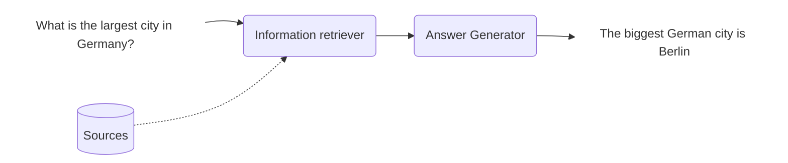

# Application Overview



## Streamlit Application (Python)

The Streamlit application relies on a Redis stack running on localhost 6379. This is used to store the document chunks. The primary script to run to create these chunks is `main.py` found in the `redis` directory.

Before you begin, you must ensure that the configurations in the `config.py` file meet your requirements. The contents of the `config.py` file are as follows:
```python
COMPLETIONS_MODEL = "YOUR_COMPLETIONS_MODEL"
EMBEDDINGS_MODEL = "YOUR_EMBEDDINGS_MODEL"
TEXT_EMBEDDING_CHUNK_SIZE=200 #Sets the size of the chunks in which the text will be divided for embedding.
VECTOR_FIELD_NAME='content_vector' #Specifies the name of the vector field.
INDEX_NAME = "index_300t_chunks" #Specifies the name of the index to be created or used in the Redis database.
PREFIX = INDEX_NAME #Prefix for the index (here the same as the index name).
```

Here is a basic rundown of the main steps that the `main.py` accomplishes:

1. It first establishes a connection to the Redis stack.
2. Then, it checks if the Redis connection is functioning properly.
3. If an index does not exist, it creates a new one.
4. For each PDF file, it creates a text map.
5. This text is then cleaned and sent to the embedding model (either "ada" or "e5-large-v2") to generate embeddings.
6. It generates an unique ID for each text chunk.
7. Then, it saves the chunks to the Redis index.


## Nextjs Application

*Code is Read-only as it uses private packages*
- Requires a Redis stack running on localhost 6379 with already created indexes.