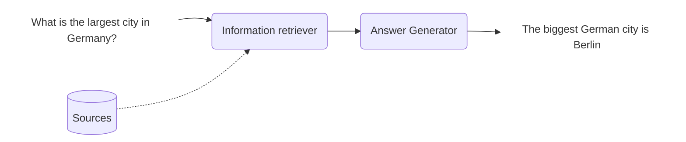

# Application Overview

```mermaid
graph LR
    Q["What is the largest city in Germany?"]
    S[(Sources)]
    IR(Information retriever)
    AG(Answer Generator)
    A["The biggest German city is Berlin"]
    Q --> IR
    S -.-> IR
    IR --> AG
    AG --> A
    Q ~~~ A
    style Q stroke-width: 0px, fill:transparent
    style A fill:transparent, stroke-width:0px
```

## Features

