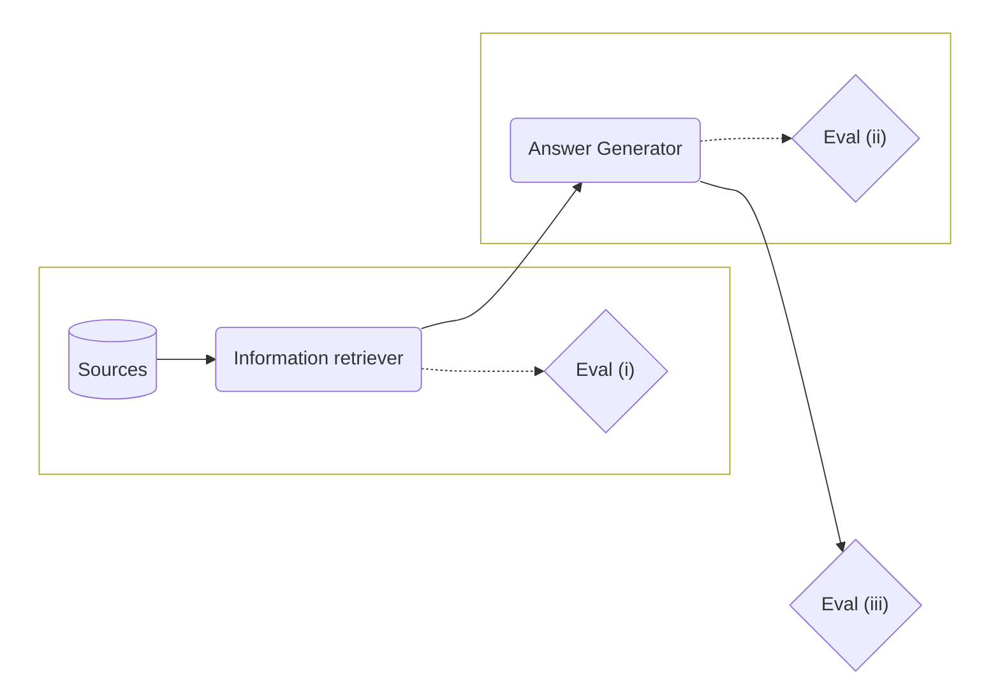

## Methodology

The system presented in this repo aims to extract meaningful content from an arbitrary number of reference documents and consequently answer a question. The goal is to ensure that the generated answer is in line with the reference documents in terms of coherence, readability, conciseness, and factual accuracy. The evaluation of such a system can therefore be divided into (i) extraction of relevant content and (ii) generation of the answer. It is thus recommended to evaluate these two tasks separately and finally in cooperation also to assess the (iii) overall performance of the question-answer system. The following will detail these three evaluation points.



## Setup

The scripts and components provided allow for a modular and customizable evaluation of the question-answer system. This allows for fine-tuning and improvements as needed, based on the evaluation results.
For a comprehensive evaluation and the ability to quickly adjust to any changes that may have to be made, the evaluation is structured in three main components:

- **Component Classes**
- **Registry Class**
- **EvalRun Class**

### Component Classes
The component classes are divided into three base components, each fulfilling a specific role in the system:

- **Embedding Model**: This class converts a given string into a vector. The method implementing this function must conform to the `EmbeddingsFn` signature and is configured to take in the string to be embedded as an argument and return a list of floats representing the embedded vector.

- **Information Retriever**: This class's task is to find k similar documents to a given query. It must conform to the `RetrieverFn` signature and is configured to receive a query and an `EmbeddingsFn` object to be used for embedding the query. It returns a pandas dataframe representing the retrieved documents and its metadata (e.g. filename, id, vector score).

- **Answer Generator (e.g., Language Model)**: This class generates responses based on a given prompt, a query, and optional sources. It must conform to the `CompletionFn` signature and is configured to receive a prompt template, a query, and optionally an `EmbeddingsFn` and a `RetrieverFn` object. It returns a `CompletionResult` object containing the generated completion.

### Registry Class
The Registry class handles component configurations. It loads and creates components defined in configuration files in the `registry` folder. When a user wants to use a component class in an evaluation configuration, they can simply adjust the corresponding configuration file in the `registry` folder to specify the desired class and additional parameters required to initialize the class. The Registry class is used at runtime to instantiate and execute the class defined in the configuration file.

Example from [evaluation/registry/llm/text-davinci-003.yaml](https://github.com/benzproduction/bachelorarbeit/blob/main/evaluation/registry/llm/text-davinci-003.yaml):

```yaml
text-davinci-003:
  class: components.llms:OpenAICompletionFn
  args:
    deployment_name: davinci
    api_key: ${OPENAI_API_KEY}
    api_base: ${AZURE_OPENAI_ENDPOINT}
    extra_options:
      temperature: 0
      n: 1
      max_tokens: 300
```

### EvalRun Class
The `EvalRun` class is responsible for conducting the actual evaluation. It receives from the `run.py` script a `RunSpec` that includes the executable classes loaded via the Registry and the corresponding dataset. The `EvalRun` class then iterates over the test samples and calculates corresponding metrics. The results are saved in a JSONL file, so the results can be traced and analyzed.

If other metrics are to be used, it is necessary to adjust the `EvalRun` class and, in particular, the `run` function.

## Running an Evaluation
To conduct an evaluation, run the `run.py` script. This script will prompt the user with a series of questions, guiding them through the setup process for the evaluation. This includes specifying the **type of evaluation**, selecting the desired **configuration** for the evaluation from the `registry` folder, and choosing the **test dataset**.

Following the prompts and making the appropriate selections will initiate the evaluation, with results stored in the `evaluation/runs` folder for review and analysis. This setup allows for quick adjustments to various components and configurations without the need for extensive code changes or adjustments to previous configurations.